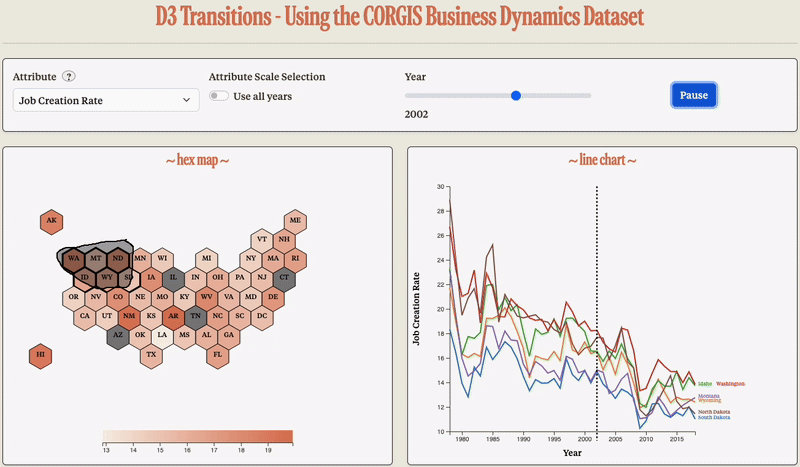

# HexLines: US Business Dynamics Explorer

An interactive D3.js visualization that lets you explore the CORGIS Business Dynamics dataset across US states. The left panel renders a labeled US **hex map** with a color legend. The right panel shows a **multi-line chart** for any states you lasso-select on the map. A year slider, scale toggle, and play control make temporal patterns easy to scan.



## Demo highlights
- **Hex map with legend** driven by a sequential color scale. The legend updates smoothly as you switch attributes or scale modes.
- **Lasso selection** on the hex map to choose states. The linked line chart updates to show time series for the selected states.
- **Year slider + Play button** to animate year changes. A dashed vertical marker tracks the current year in the line chart.
- **Attribute tooltip** that explains the currently selected metric on hover.
- **Clean, modern styling** inspired by Anthropic aesthetics and Bootstrap for basic layout.

---

## Table of contents
- [Project structure](#project-structure)
- [Features](#features)
- [Data](#data)
- [Getting started](#getting-started)
- [How to use the app](#how-to-use-the-app)
- [Development notes](#development-notes)
- [Known limitations](#known-limitations)
- [Tech stack](#tech-stack)
- [Credits](#credits)
- [License](#license)

---

## Project structure
```
hexlines-business-dynamics/
├─ index.html
├─ style.css
├─ main.js
├─ data/
│  └─ business_dynamics.csv
├─ fonts/
│  ├─ TestTiemposText-Medium-BF66457a508489a.otf
│  └─ CopernicusNewCondTrial-110-BF6616045000e13.otf
└─ README.md
```

- `index.html` wires up Bootstrap, D3 v7, your CSS and JS, and lays out the control panel plus the two SVG panels.  
- `style.css` provides the warm palette, typography, and UI polish including the tooltip and slider styling.  
- `main.js` loads the dataset and hex-grid GeoJSON, renders the hex map, legend, lasso, and synchronized multi-line chart with transitions.  

---

## Features
- **Attribute selector** for five Business Dynamics metrics, with an inline **tooltip** that describes each choice.
- **Scale toggle** to compute color domains from either the current year or from all years. The legend animates when domains change.
- **Year slider** that updates both visuals, plus **Play** to auto-advance the year.
- **Linked views**: lasso states on the map to populate the multi-line chart. A vertical dashed line marks the current year.
- **Smart label merge** on the line chart to reduce overlapping state labels at series endpoints.
- **Bootstrap layout** and a warm aesthetic with custom fonts.

---

## Data
- **Primary CSV**: `data/business_dynamics.csv` following the CORGIS Business Dynamics schema expected by the code. Make sure the file name and column headers match the script’s references such as `State`, `Year`, and selected metric columns like `Data.Job Creation.Rate`.  
- **Hex grid**: US states hexgrid GeoJSON fetched directly at runtime from the D3 Graph Gallery repo. No local file needed.

> Note: The code treats four states as absent from the hex grid mapping and excludes them in the line chart to avoid downstream issues. These are Arizona, Illinois, Connecticut, and Tennessee.  

---

## Getting started

### Prerequisites
- A local static server to avoid browser file-access restrictions. Python is the quickest option. Or use Visual Studio Code Live Server. 
- The fonts in `/fonts` must be present or you can remove the `@font-face` declarations in the CSS.   

Clone the repo and run it on your local machine via VS Code Live Server! No setup required. 

---

## How to use the app
1. Pick an **Attribute** from the dropdown. Hover the **?** icon to see a short description of that metric.  
2. Choose **Use all years** to fix the color scale domain across the full time span, or leave it unchecked to scale by the current year. The legend updates accordingly.  
3. Drag the **Year** slider or press **Play** to animate. The hex map recolors and the line chart’s vertical marker moves with the selected year.  
4. **Lasso** a set of states on the map to populate the multi-line chart. Click inside the line chart background to jump the current year to the clicked position.  

---

## Development notes
- **Rendering pipeline**  
  - Data load via `d3.csv` with `d3.autoType`, plus GeoJSON fetch via `d3.json`, then `renderHexMap()` initializes the hex map and legend.  
  - Color legend is created once then updated with smooth transitions when domains change.  
  - Lasso drag handlers capture mouse coordinates, draw the path, and compute state centroids against the drawn polygon. Selected states receive a CSS class used downstream.  
  - The line chart computes scales from selected states, draws axes, lines, labels, and a vertical year marker. Label merging reduces collisions.  
- **Styling**  
  - Warm background and accent color, Bootstrap components, custom slider thumb, and a lightweight tooltip.  

---

## Known limitations
- **Missing states in hex grid**: Arizona, Illinois, Connecticut, and Tennessee are explicitly excluded in the line chart logic to avoid inconsistencies.  
- **Legend creation** currently uses separate create and update functions and could be refactored into a single reusable legend component.  
- **Font loading** requires the two `.otf` files in `/fonts`. If absent, switch to system fonts in the CSS.  

---

## Tech stack
- **D3.js v7** for data joins, scales, axes, transitions, and behaviors.  
- **Bootstrap 5** for grid and form styling.  
- **Vanilla JS** modules for rendering, lasso selection, legend updates, and label layout.  

---

## Credits
- Dataset: CORGIS Business Dynamics (linked in code comments).  
- Hex grid GeoJSON: D3 Graph Gallery source, fetched at runtime.  
- Various D3 references are cited in code comments for lasso, legends, axes, and transitions.  

---

## License
MIT. You are free to use, adapt, and share with attribution.
